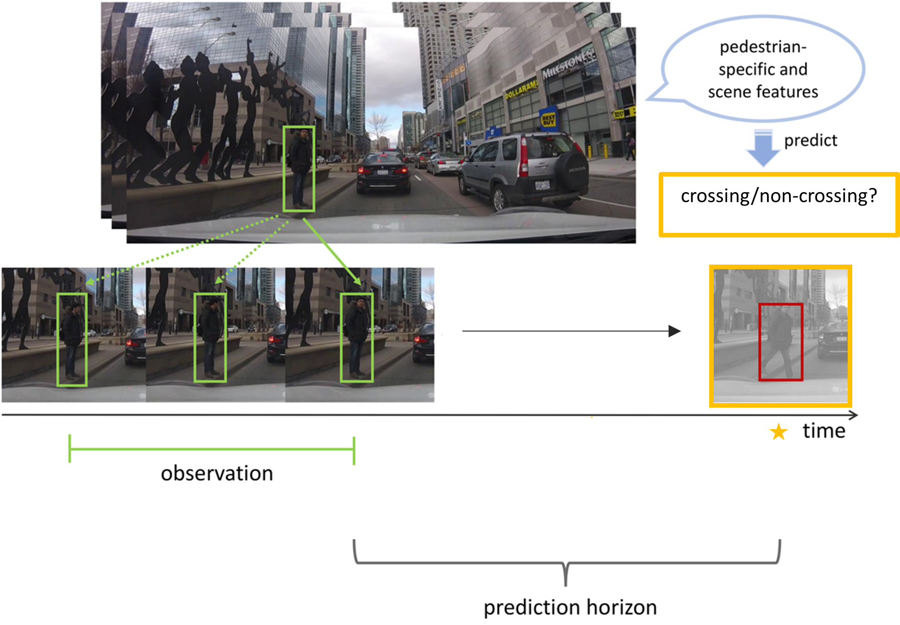
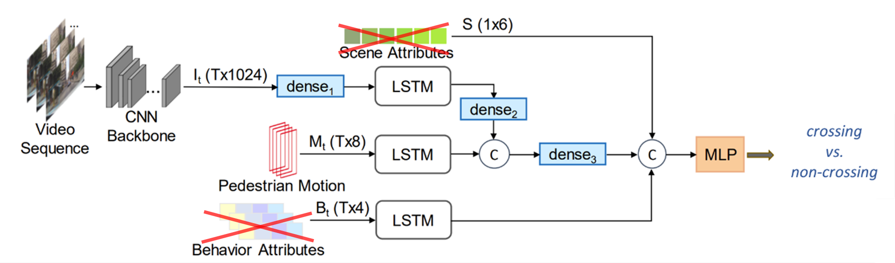
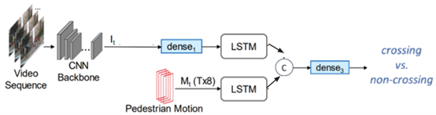
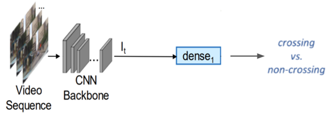
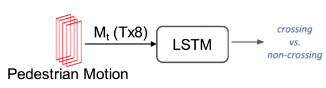

# Pedestrian Intention Detection with Hybrid Feature Fusion
The project is based on [Pedestrian Stop and Go Forecasting with Hybrid Feature Fusion](https://github.com/vita-epfl/hybrid-feature-fusion).
## Introduction
The goal of pedestrian intention prediction is to determine, for each prediction timestep, whether a given pedestrian will be crossing or non-crossing the road based on a sequence of past observations. 



### Contribution Overview
Drawing inspiration from the *Pedestrian Stop and Go Forecasting with Hybrid Feature Fusion* [1], which focuses on state transition prediction, we adapt their model and approach to our specific crossing/non-crossing task. The model including four modules: **visual information** (encode with CNN), **position and relative velocity** (bounding box), **pedestrain behavior**, **scene description**. 

<p align="center">
  
</p>
<p align="center"><em>Pipeline of hybrid model</em></p>

The model employs individual LSTM units for three of modalities and applies a hybrid fusion technique, combining linear projections and concatenations, to integrate the multi-modal embeddings and obtain the final prediction.

## Experimental Setup
In order to maintain consistency and improve the system's performance, we made two important decisions. Firstly, we opted to eliminate scene descriptions from the model to mitigate the risk of overfitting on scene attributes, which can adversely affect evaluation results. This adjustment enables the model to concentrate on learning other pertinent information more efficiently. Secondly, we also chose to exclude behavior data from the system. This decision was driven by the challenge of obtaining such data in real-life scenarios, ensuring that our system remains applicable and practical in real-world applications.

<p align="center">
  
</p>
<p align="center"><em>Pipeline of our hybrid model</em></p>

Prior to training the hybrid model, we separately trained the CNN encoder with Resnet18 Backbone (image module) and LSTM encoder (pedestrian motion). These models were then utilized as pretrained checkpoints during the training of the hybrid model.
<p align="center">
  
</p>
<p align="center"><em>Pipeline of training cnn encoder</em></p>

<p align="center">
  
</p>
<p align="center"><em>Pipeline of training rnn encoder for pedestrian motion</em></p>

## Dataset
**JAAD** [2] has been selected as the dataset. **JAAD** focuses on investigating pedestrian road crossing behaviors using a dataset comprising 346 videos which encompassing a range of weather and lighting conditions. Each pedestrian in the dataset is annotated with bounding boxes, behavioral data, and demographic information. 
### Label
- **crossing/non-crossing**: {0: 'not-crossing', 1: 'crossing'}
The label assigned to a given sequence of past observations corresponds to the cross/non-cross label of the given prediction timestep.
### Input
- **visual context**: (channel x image height x image width)

a sequence of RGB images cropped with corresponding pedestrian bounding box and backbround information. 
- **bounding boxes and relative velocities**: $(x_t, y_t, H_t, W_t, \Delta x_t, \Delta y_t, \Delta H_t, \Delta W_t)$

$P_t = (x_t, y_t, H_t, W_t)$ -> bounding box of corresponding pedestrian

$V_t = (\Delta x_t, \Delta y_t, \Delta H_t, \Delta W_t) = (x_t - x_{t-1}, y_t - y_{t-1}, H_t - H_{t-1}, W_t - W_{t-1})$ -> relative velocity of the pedestrian

### Output
- **p<sub>t</sub>**: the probability of crossing for each of the prediction timesteps

### Download dataset

Please follow the [instructions](https://github.com/vita-epfl/pedestrian-transition-dataset#data-preparation) to prepare the JAAD data.

Furthermore, the prepared data also could be find in "/work/scitas-share/datasets/Vita/civil-459"
```
#Replace the follwing path in src/dataset/loader.py -> def define_path() to your own path
all_anns_paths = {'JAAD': {'anns': '/work/scitas-share/datasets/Vita/civil-459/JAAD/data_cache/jaad_database.pkl',
                          'split': 'DATA/annotations/JAAD/splits/'},
                           }
all_image_dir = {'JAAD': '/work/scitas-share/datasets/Vita/civil-459/JAAD/images',}
```

## Installation
Clone this repository in order to use it.
```
# To clone the repository using HTTPS
git clone ????????????????????????????
cd ??????????????????/
```

All dependencies can be found in the `requirements.txt` file.
```
# To install dependencies
pip install -r requirements.txt
# To install torch with cuda
pip install torch==1.10.1+cu111 torchvision==0.11.2+cu111 torchaudio==0.10.1 -f https://download.pytorch.org/whl/cu111/torch_stable.html
```

This project has been tested with Python 3.7.7, PyTorch 1.10.1, CUDA 11.1.

## Train

Traning hybrid model:
```
train_crnn.py --cnn-encoder-path checkpoints/upbeat-wood-247/CNN_Encoder.pt --rnn-decoder-path checkpoints/vague-darkness-248/LSTM_pos_vel.pt --pred 5 --max-frame 5 -lr 5e-6 -wd 1e-2 --early-stopping-patience 5
```
Training cnn encoder:
```
train_cnn.py --epochs 50 --early-stopping-patience 5 -wd 1e-3 --pred 5 -lr 1e-5
```

Training rnn encoder:
```
train_rnn.py --epochs 50 --early-stopping-patience 5 -lr 1e-4 -wd 1e-4 --pred 5 --max-frames 5
```

## Inference
The models are assessed using the F1 score, and to facilitate further analysis, we additionally provide the confusion matrices.

Evaluate hybrid model:
```
python eval_hybrid.py -cp checkpoints/put_your_checkpoints_path_here --max-frames 5 --pred 5 --mode hybrid
```
Evaluate cnn model:
```
python eval_hybrid.py -cp checkpoints/put_your_checkpoints_path_here --pred 5 --mode cnn_only
```
Evaluate rnn model:
```
python eval_hybrid.py -cp checkpoints/put_your_checkpoints_path_here --max-frames 5 --pred 5 --mode rnn_only
```

## Results


|  | Test/f1 |
| -------------- | -------------- |
| Hybrid model | 0.8035 |
| CNN encoder | 0.7808 |
| RNN encoder | 0.812 |

The detailed plots(loss, f1, prediction distribution ....) could be found in the following link:
[hybrid model]( https://wandb.ai/arinaruck/dlav-intention-prediction/runs/h8g4l4cn/overview?workspace=user-arinaruck)
[cnn encoder](https://wandb.ai/arinaruck/dlav-intention-prediction/runs/5pom7rto?workspace=user-arinaruck)
[rnn encoder](https://wandb.ai/arinaruck/dlav-intention-prediction/runs/3qb1j952?workspace=user-arinaruck)

### Visualization
**Green**: crossing **Red**: non-crossing
**Target**: word **Prediction**: bounding box


## Conclusion


## Reference
[1] Dongxu Guo, Taylor Mordan, and Alexandre Alahi. *Pedestrian Stop and Go Forecasting with Hybrid Feature Fusion*. 2022. [arXiv: 2203.02489 [cs.CV]](https://arxiv.org/abs/2203.02489) .
[2] Amir Rasouli, Iuliia Kotseruba, and John K. Tsotsos. “Are They Going to Cross? A Benchmark Dataset and Baseline for Pedestrian Crosswalk Behavior”. In: 2017 *IEEE International Conference on Computer Vision Workshops (ICCVW)*. 2017, pp. 206–213. doi: [10.1109/ICCVW.2017.33](https://ieeexplore.ieee.org/document/8265243).
